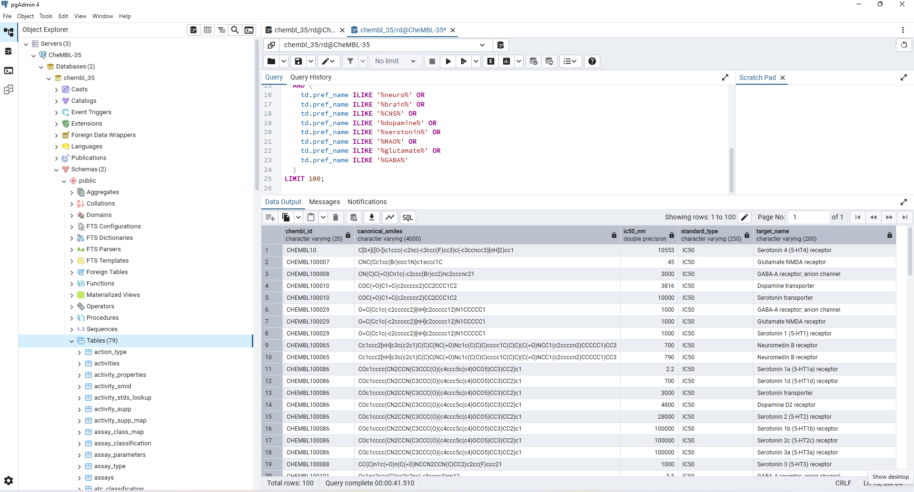
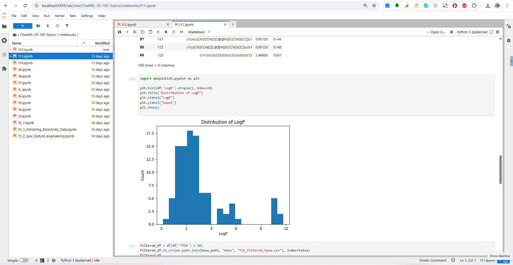
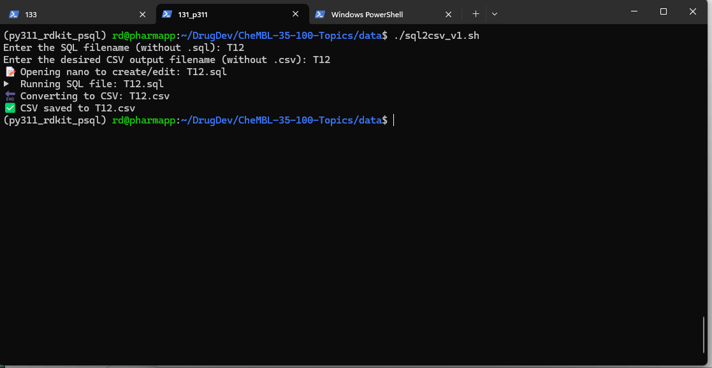
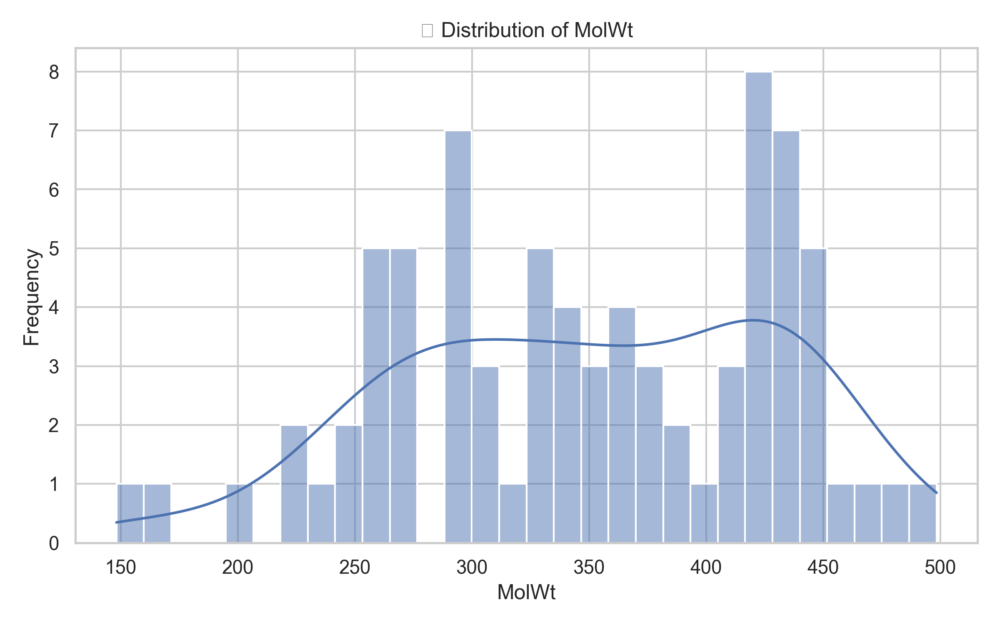
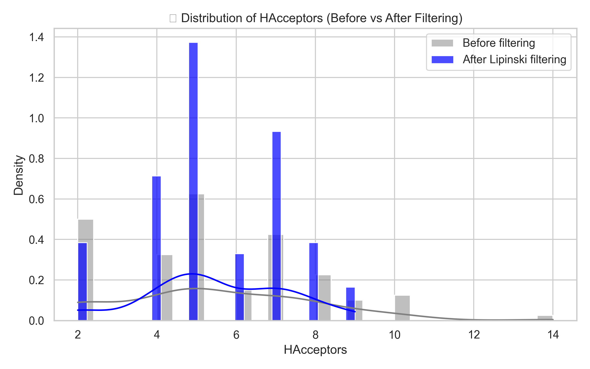
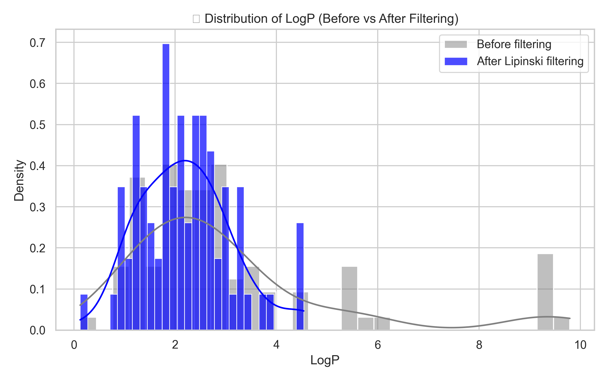
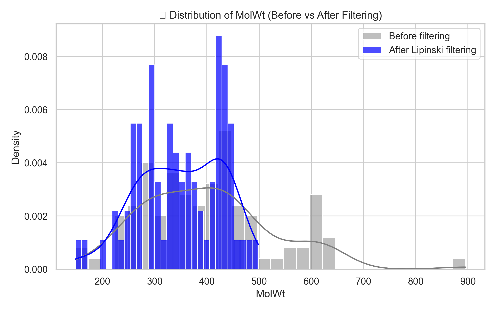
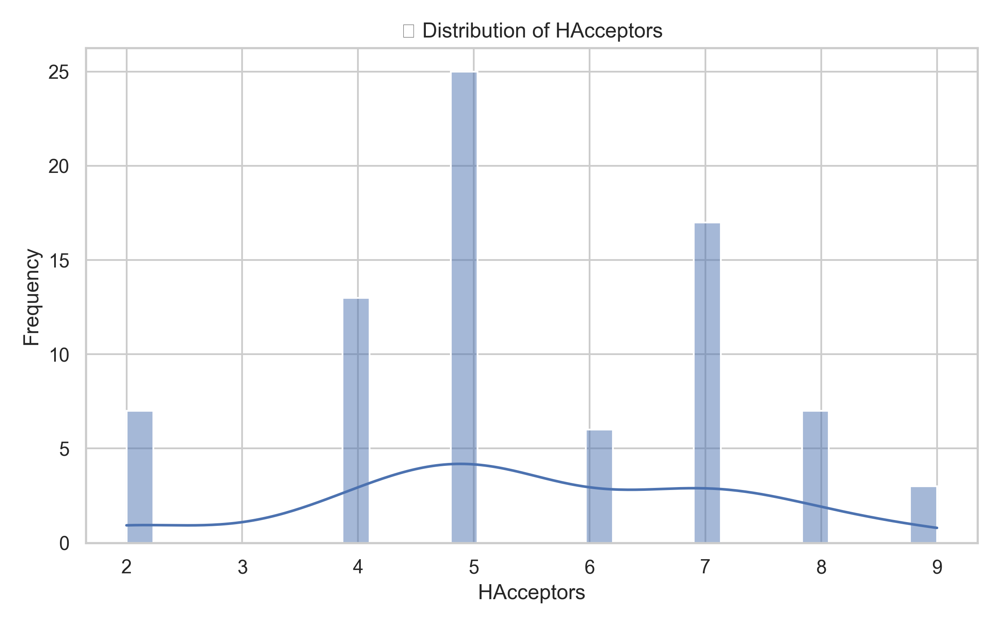
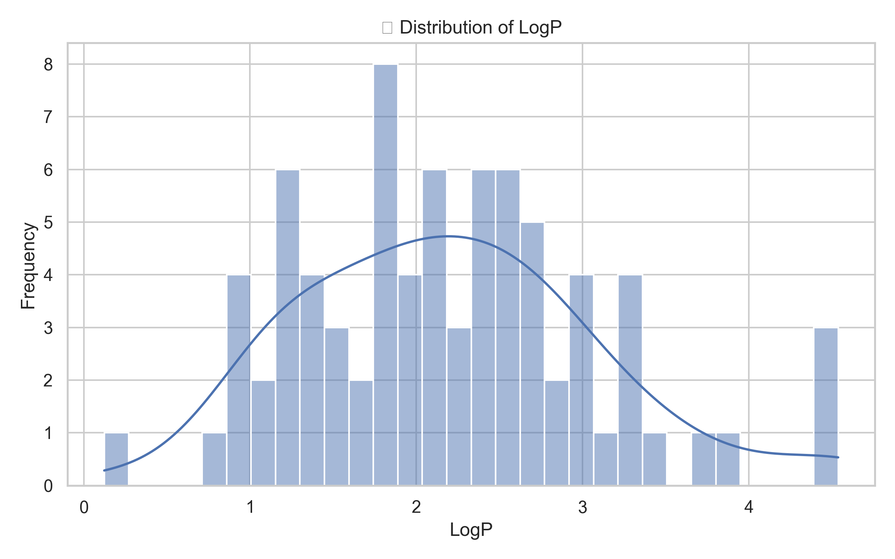

# 🔬 CheMBL 35 Drug Discovery Project


A streamlined, reproducible AI/ML pipeline for exploring and analyzing ChEMBL 35 data for drug discovery and development using PostgreSQL, RDKit, and Python. The project follows AIMLOps folder standards and is designed for pharmaceutical R&D teams.

---

## 🌐 Website

▶️ Full documentation & blog post:  
**[https://www.nghiencuuthuoc.com/2025/05/khai-thac-du-lieu-chembl35-trong-tri.html](https://www.nghiencuuthuoc.com/2025/05/khai-thac-du-lieu-chembl35-trong-tri.html)**

---

## 📁 Folder Structure (AIMLOps Template)

```
CheMBL35-Drug-Discovery/
│
├── notebook/                # Jupyter Notebooks (e.g., T1_1_*.ipynb, T2_1_*.ipynb)
├── data/                    # Extracted .csv from PostgreSQL
├── src/                     # Python modules and helper functions
├── images/                  # Visualizations and screenshots
├── assets/                 # Logo and design elements
├── scripts/                 # Shell & automation scripts
└── README.md                # Project description
```

---

## ⚙️ Technologies Used

- 🧪 **RDKit** for chemical descriptor calculations
- 🧬 **PostgreSQL (ChEMBL 35)** as backend database
- 📊 **Pandas, Scikit-learn** for data handling and modeling
- 🚀 **Streamlit** for app interface (optional)
- 🔁 **AutoML: H2O.ai / Auto-sklearn** for modeling (optional)
- 🧠 **AI/ML pipeline** for drug-likeness, activity prediction, CNS screening, etc.

---

## ▶️ How to Run

```bash
# Example: load CSV from PostgreSQL and analyze in notebook
$ cd notebook/
$ jupyter notebook T1_1_finding_natural_product_like_molecules.ipynb
```

```python
# Sample connection string using SQLAlchemy + RDKit
from sqlalchemy import create_engine
engine = create_engine("postgresql+psycopg2://rd:rd@192.168.206.136/chembl_35")
```

---

## 🖼 Screenshots






---

## Figure










---

## 📄 License

This project is licensed under the **MIT License**.  
Feel free to use, modify, and distribute.

---

## ©️ Credits

- 📌 **Nghiên Cứu Thuốc – 2025**
- 🌍 www.nghiencuuthuoc.com
- ✉️ nghiencuuthuoc@gmail.com
